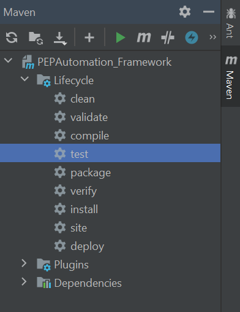
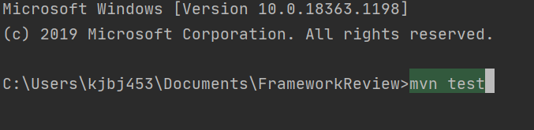
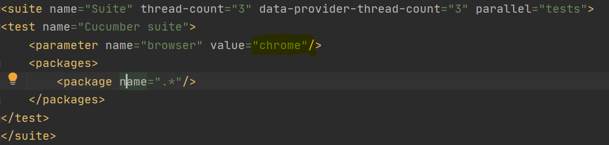

# How to run scenarios

1. Running with Maven
2. Running with XML file
3. Chose a browser to execute 
4. Running tests with Browserstack
5. Running tests in parallel
-----------------------

# Running with Maven.

:pushpin: To execute the framework with maven, you can open the
maven bar displayed on the right side.  
:pushpin: After opening the maven bar, you can select 
any maven life cycle command.

:pushpin: If you want to execute with the terminal, just type 
`mvn test + enter` or any command you need.  

# Running tests with XML file

:pushpin: To run tests with the XML file just open it -> right click ->
Chose the option to run/debug with TestNG/Cucumber.
`path: src/test/java/testng.xml`

# Chose a browser to execute

:pushpin: In the XML file you can type the parameter chrome/firefox.
`path: src/test/java/testng.xml`

:pushpin: This step is optional: To run the tests in headless mode, you can
enable the option in the GlobalConfig.properties file.
`path: src/main/java/config/GlobalConfig.properties`

# Enable BrowserStack

:pushpin: To enable BrowserStack open the GlobalConfig.properties.

:pushpin: Identify the  field `browserstack` and type true to enable BrowserStack.
`path: src/test/java/testng.xml`

# Run tests in parallel

:pushpin: You can execute tests in parallel in your local computer or remotely
using browserstack, you can add the configuration in the XML file
and modify the runner class using a data provider or only tests in different clasess.

For more reference, [click here](https://testng.org/doc/documentation-main.html#parallel-running)  