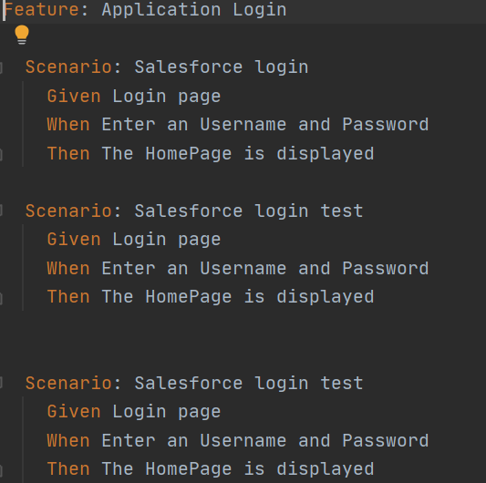
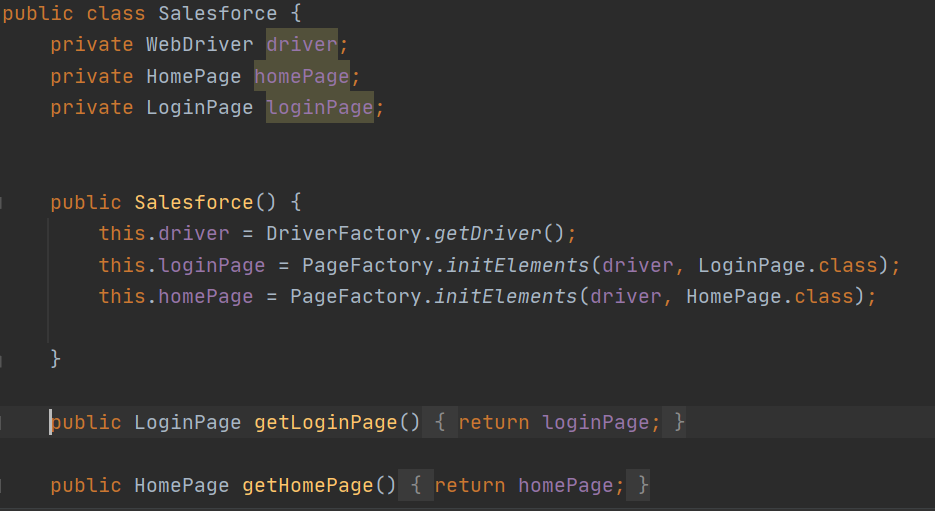
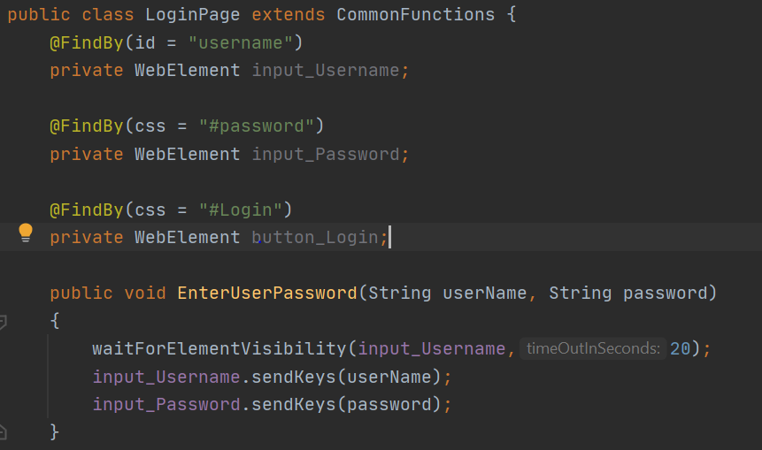
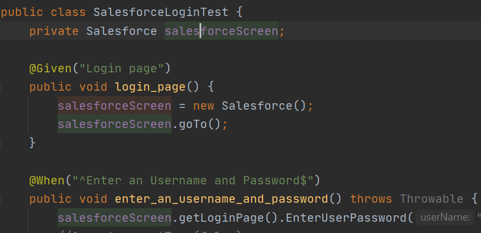

# Content

How to create a new Test Case

1. Features

2. Page Object

3. Step Definition

-----------------------

# Features

The _features_ folder contain the description for each test case
in [gherkin language](https://cucumber.io/docs/gherkin/reference/),
you should follow the next steps to add new content:
 
1. Add a package for each application with a description name `example: Salesforce`.
2. Right-click inside the folder and add a new file  `example: SalesforceLogin.feature`
3. Inside the file, you can add the list of test cases that belong to _log in_,
if you want to add test cases for a new feature or user story, you should add 
a new feature file with the description name.

>Folder path: `src/test/java/features`   

# Page Object
The page object contain the application and pages folders, follow
the next steps:

1. In the application folder, you  can create a class with the application name,
in this class, you must initialize and return the page types.
    1. The constructor makes the instance of the page factory and WebDriver for
    each page.
    2. The getters return the page with their methods.

2. In the _pages_ folder, you should add a new package for each application.
    1. Create a new class with the page name `example: LoginPage`
    2. The class extends from _CommonFunctions_, that class contains 
    the generic selenium methods to manipulate web elements.
    3. The top of the class contains the web elements.
    4. The bottom of the class contains the methods with the page actions 
    `example: ClickLogin, EnterUsernName, etc...`

    
>Folder path: `src/main/java/pageObject`

# Step Definition

The step definition package contain the folders with the steps
for each application, the classes contain the keyword given 
in the cucumber test cases.

1. Add a new folder for each application, user story or feature
inside the step definition package.
2. Create a class with the test case description.
3. You must create an instance of the desired application
   `example: Salesforce salesforce = new Salesforce()` 
4. The next step in to add the methods with the steps that 
were create in the feature file, if you need help, you can
use the [tidy gherkin plugin](https://chrome.google.com/webstore/detail/tidy-gherkin/nobemmencanophcnicjhfhnjiimegjeo?hl=en-GB).   
5. For each method you have the ability to call the pages and methods
that were defined in the _pageObject_ folder
    `example: salesforce.getLoginPage().enterUserName()`
    
    