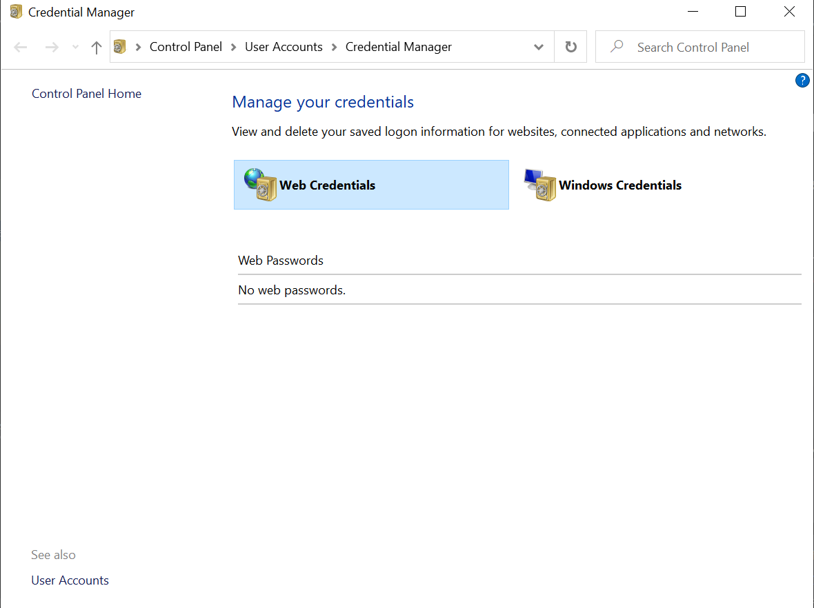

# Content

Clone the repository for windows
1. Tools
2. Git Configuration
3. By HTTPS
-----------------------


# Clone the repository for windows

## Tools

### For Windows
Download the `Git CMD` tool in order to clone this repository from terminal

- [Download Git CMD](https://git-scm.com/downloads)

## Git Configuration
Apply the following command if you have not configured `Git` in your machine:

```bash
git config --global user.name "<YOUR NAME>"
git config --global user.email "<YOUR AZTRAZENECA EMAIL>"
```

To make sure that the above commands were applied correctly type the following command in terminal:

```bash
git config --list | grep user
```

### Removing an entry global configuration
If you made a mistake writing any `git global variables` type the following command:

```bash
git config --global --unset <variable>
```

> Where `<variable>` could be either "**user.name**" or "**user.email**"

## By HTTPS
Cloning the repository by `HTTPS` protocol means that every time you need to upload a change or clone 
this repository it will ask you for your credentials

Type the following command in the terminal:

```bash
git clone https://kjbj453@bitbucket.org/csdc/automation-gdl.git
```

:eyes: The credentials are your `PRID` (without astrazeneca domain) and your current password

> Note: If you typed wrong credentials on Windows you can change it from [Credential Manager](https://support.microsoft.com/en-us/help/4026814/windows-accessing-credential-manager)

