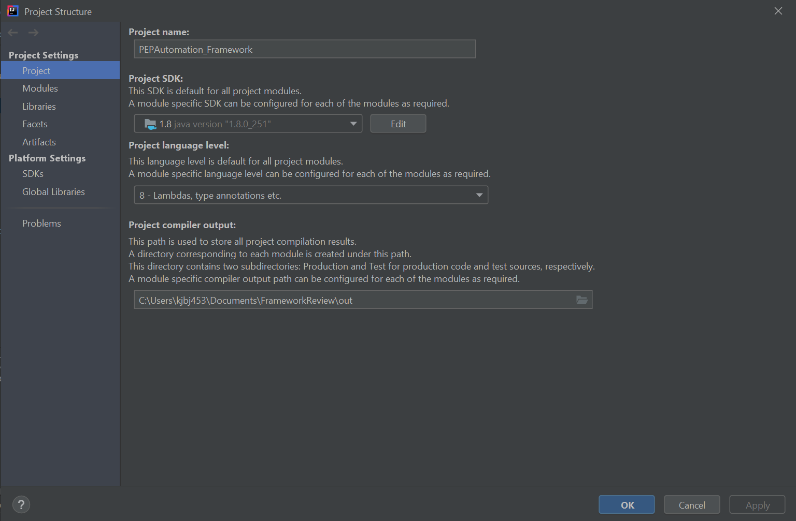

# Table of Contents
1. Download Intellij IDE
1. Importing a Project
2. Project Structure
3. Install plugins
    
-----------------------

# Download Intellij IDE
Download the **Community Version** :point_right: [Download IntelliJ IDEA](https://www.jetbrains.com/idea)

## Importing a Project

1 - Open `IntelliJ IDEA` and select the option **Import Project**, then select the repository downloaded, or
    if you can download the project using an existing repository path.

2 - If you already have an opened project, you cna follow the next steps:
    
    `File -> Project From Existing Sources -> Open the project -> Import as Maven`
    
    `File -> Project From Version Control -> Clone the project with the repository path`

# Project Structure
A project structure needs to be setup on `IntellIJ`.

:bangbang: The minimum Java Version supported is `Java 8` and you have to set it in the Project Structure.

:pushpin: **Go to File > Project Structure**:

1. Set Project SDK to `1.8 Java Version`
2. Set Project Language Level to `8 - Lambdas, type annotations, etc.`

# Install Plugins

1. To install the required plugin type `Ctrl + Alt + s`
2. Click on the _plugins_ section
3. Search and install the following plugins:
    1. Cucumber for Java
    2. Gherkin
    3. Maven helper
4. After to install the plugins, restart `IntellIJ`   
