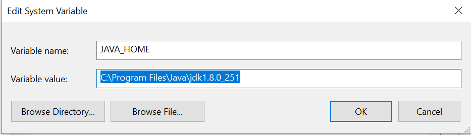

# Content

1. Install Java
    1. Java version
        1. How do I know what Java version I have?
    2. Oracle account
    3. Download Java
-----------------------

### Install Java
## Java version
:exclamation: The minimum version required is `Java 8`

### How do I know what Java version I have?

If you are using windows, open the terminal and type `java -version`,
then if you have Java installed in your machine, the Java version should be displayed

## Oracle account
To download Java from the official page you need to have an Oracle account.
Use the following link to create the account:

- [Create an Oracle account](https://profile.oracle.com/myprofile/account/create-account.jspx)

## Download Java
Once you've created the `Oracle account` proceed to download `Java` from the official site according to your OS:

- [Download Java JDK 8](https://www.oracle.com/java/technologies/javase-jdk8-downloads.html)

For windows, after to install Java, you must add an environment variable.

:pushpin: In the windows search bar type `Edit the system environment variables`
and hit enter.  

:pushpin: Click on environment variables.

:pushpin: Click on New(Second window).

:pushpin: Add the variable name `JAVA_HOME` and the java installation path.

:pushpin: Save the changes and review the correct java version was installing.

> In this step, you will need your **Oracle account**

